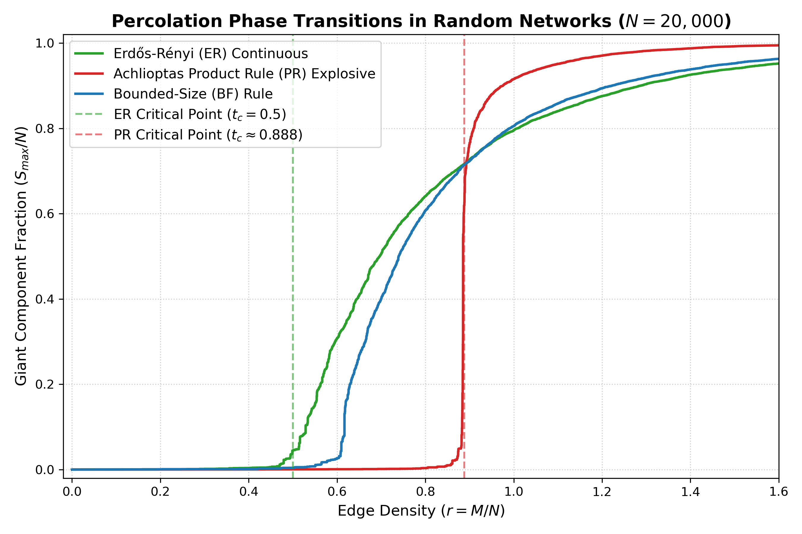

# Percolation Transitions in Complex Networks: Continuous & Explosive

[](https://www.python.org/)
[](https://jupyter.org/)

An efficient computational physics implementation of **continuous (Erdős–Rényi)** and **discontinuous (Achlioptas Product Rule)** percolation phase transitions in complex networks using $O(1)$ Union-Find (Disjoint-Set) data structures.

---

## 🔬 Overview & Theoretical Background

Percolation theory describes the emergence of macroscopic connectivity (the "giant component") in random networks as edges are added sequentially.

### 1. Erdős–Rényi (ER) Random Percolation
In standard random graph percolation, edges are added uniformly at random. As edge density $r = M / N$ approaches the critical threshold $t_c = 0.5$, a giant connected component emerges continuously (second-order phase transition):

$$S_{\text{max}} \sim (t - t_c)^\beta \quad (\text{with } \beta = 1)$$

### 2. Achlioptas Product Rule (PR) Explosive Percolation
Proposed by Achlioptas, D'Souza, and Spencer (*Science*, 2009), the Product Rule introduces competitive edge selection. In each step, two candidate edges $e_1 = (u_1, v_1)$ and $e_2 = (u_2, v_2)$ are sampled uniformly, and the edge minimizing the product of merging component sizes is added:

$$e^* = \arg\min_{e \in \{e_1, e_2\}} \left( S_{u_k} \times S_{v_k} \right)$$

This suppresses the growth of large components during early stages, causing an explosive, discontinuous (first-order style) transition near $t_c \approx 0.888$.

---

## 📊 Phase Transition Comparison



*Comparison of Giant Component Fraction ($S_{\max} / N$) versus Edge Density ($r = M / N$) across ER, Achlioptas PR, and Bounded-Size (BF) rules for $N = 50,000$ nodes.*

---

## 📁 Repository Structure

```
Percolation/
├── percolation_simulation.py            # High-performance Union-Find simulation module
├── percolation_analysis.ipynb           # Interactive Jupyter Notebook with analytical plots
├── test.py                              # CLI entry point script
├── explosive_percolation_transition.png # High-resolution phase transition plot
├── percolation_phase_transitions.png    # Additional phase transition visualization
├── percolation_growth_rate.png          # Numerical derivative plot d(C/N)/dt
├── README.md                            # Project documentation
└── .gitignore                           # Git ignore configuration
```

---

## 🛠️ Installation & Dependencies

### Prerequisites
- Python 3.8 or higher
- Jupyter Notebook / JupyterLab

### Dependencies
Install scientific dependencies via `pip`:

```bash
pip install numpy matplotlib scipy tqdm
```

---

## 🚀 How to Run

### 1. Run Command-Line Simulation
Execute the main Python module to simulate $N = 20,000$ nodes:

```bash
python percolation_simulation.py
```

### 2. Interactive Jupyter Notebook Analysis
Launch the interactive notebook to explore phase transitions, derivatives, and scaling:

```bash
jupyter notebook percolation_analysis.ipynb
```

---

## 📚 Key References

- **Achlioptas, D., D'Souza, R. M., & Spencer, J. (2009)**. *Explosive percolation in random networks*. Science, 323(5920), 1453-1455.
- **Stauffer, D., & Aharony, A. (2018)**. *Introduction to Percolation Theory*. Taylor & Francis.
- **Newman, M. E. (2018)**. *Networks*. Oxford University Press.
